# Building PES-VCS — A Version Control System from Scratch

**Objective:** Build a local version control system that tracks file changes, stores snapshots efficiently, and supports commit history. Every component maps directly to operating system and filesystem concepts.

**Platform:** Ubuntu 22.04

The implementation is split across four core source files:

- `object.c`: stores and reads content-addressed objects with integrity checks
- `tree.c`: builds tree objects from the staged index
- `index.c`: loads, saves, and updates the staging area
- `commit.c`: creates commits and updates repository history

The result follows a simplified Git workflow:

1. `pes add` stores file data in the object database and updates the index.
2. `pes commit` builds a tree from the index and writes a commit object.
3. `pes log` walks the commit chain through the branch reference.

---

## Getting Started

### Prerequisites

```bash
sudo apt update && sudo apt install -y gcc build-essential libssl-dev
```

### Building

```bash
make          # Build the pes binary
make all      # Build pes + test binaries
make clean    # Remove all build artifacts
```

### Author Configuration

PES-VCS reads the author name from the `PES_AUTHOR` environment variable:

```bash
export PES_AUTHOR="Your Name <PESXUG24CS042>"
```

If unset, it defaults to `"PES User <pes@localhost>"`.

## Screenshots

### Phase 1

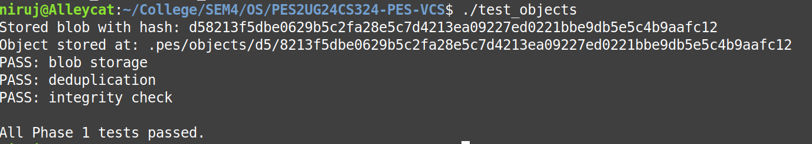

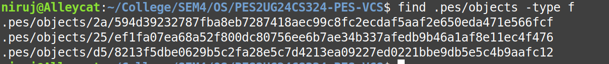

### Phase 2

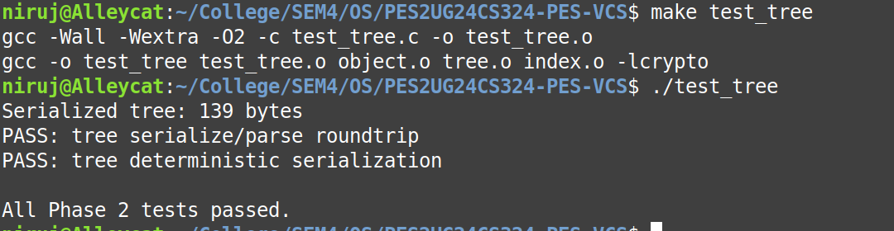

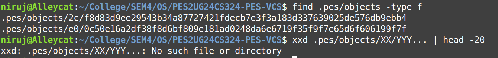

### Phase 3

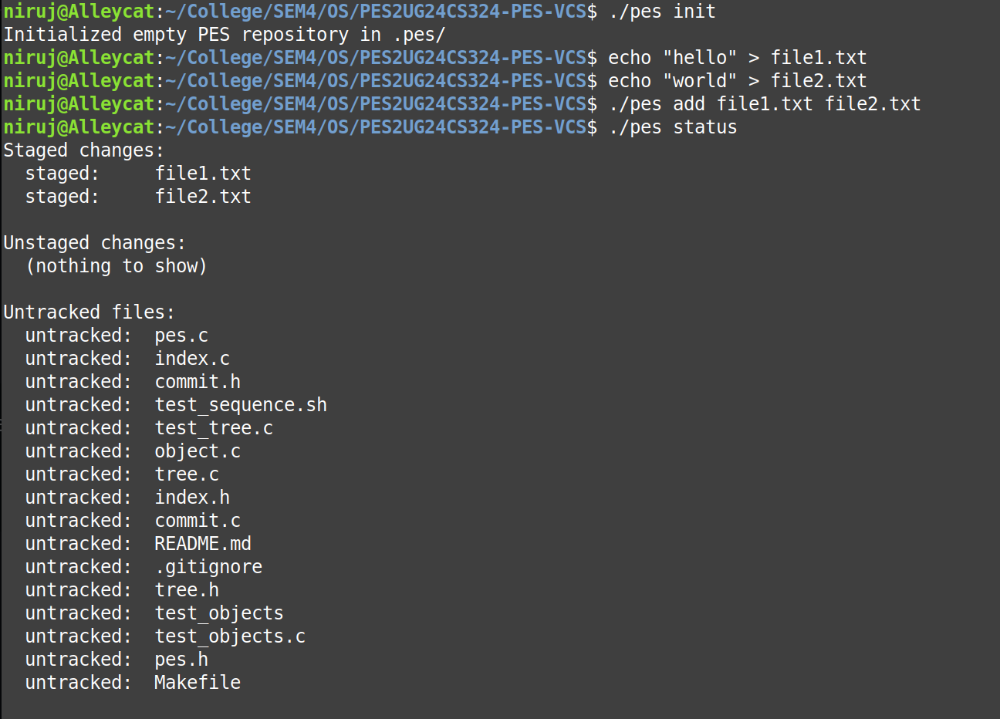

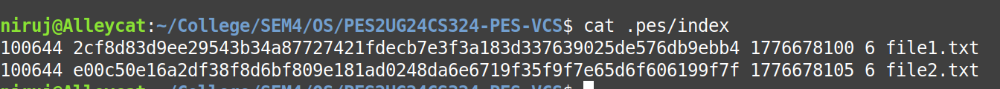

### Phase 4

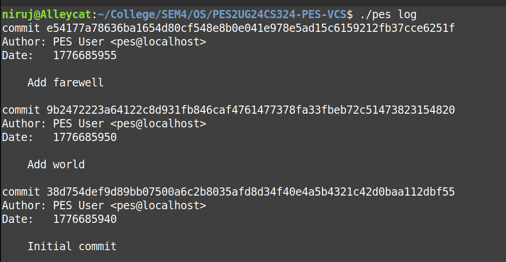

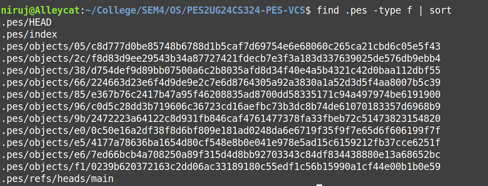

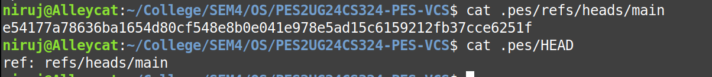

### Final

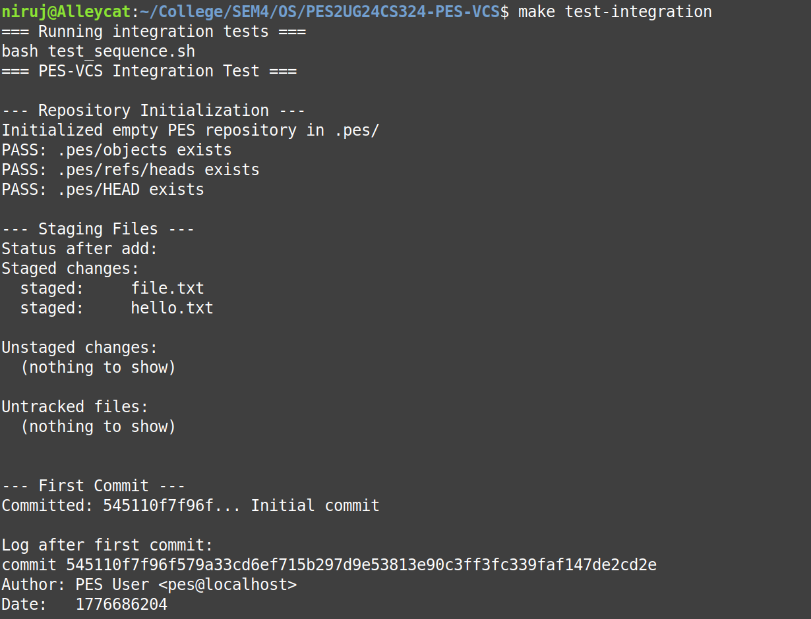

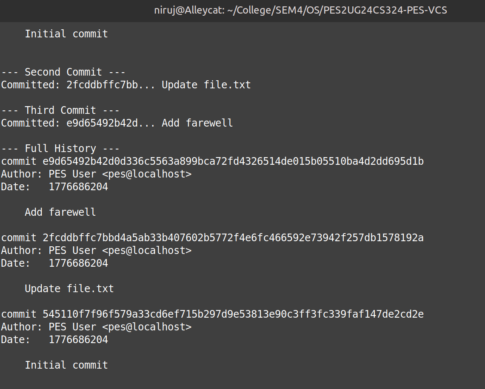

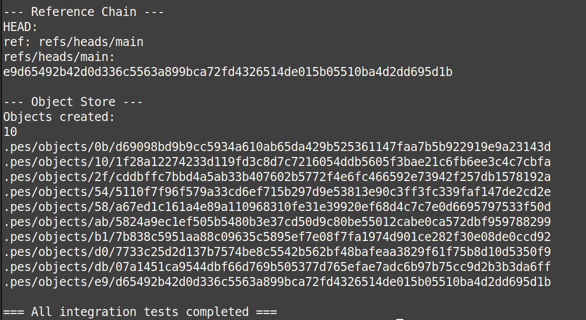

## Phase 5 & 6: Analysis Answers

### Q5.1 Branching And Checkout

To implement pes checkout \<branch>, these updates are needed:

- Validate that .pes/refs/heads/\<branch> exists.
- Update .pes/HEAD to point to that branch reference.
- Read the target commit hash from .pes/refs/heads/\<branch>.
- Load the target commit tree and rewrite the working directory to match it.
- Update .pes/index to match the checked-out tree.

The hard part is the working directory update. Files can be added, removed, modified, or conflict with local edits. The command must avoid destroying uncommitted work.

### Q5.2 Dirty Working Directory Detection

A safe check can be done in three comparisons:

1. Compare current working files with .pes/index using metadata and content hash when needed.
2. Compare current branch tree with target branch tree to find paths that differ between branches.
3. If any path is both locally modified and branch-different, abort checkout.

This blocks destructive overwrites and keeps behavior consistent with Git-like safety rules.

### Q5.3 Detached HEAD

Detached HEAD means HEAD points directly to a commit hash, not a branch file. New commits still work, but they are not attached to a named branch pointer. If the user moves away, those commits can become hard to find.

Recovery options:

- Create a new branch at that commit hash.
- Move an existing branch ref to that commit hash.

As long as the hash is known from log or object walk, the commits can be preserved.

### Q6.1 Garbage Collection Algorithm

A mark-and-sweep approach works:

1. Start from all branch heads in .pes/refs/heads.
2. Walk each reachable commit.
3. For each commit, mark its tree and parent commit.
4. For each tree, recursively mark child trees and blobs.
5. After marking, scan .pes/objects and delete unmarked objects.

Use a hash set for marked object IDs for fast O(1) membership checks.

For 100,000 commits and 50 branches, commit traversal is about 100,000 unique commits in a shared history case, plus all unique reachable trees and blobs. Exact total depends on file churn, but the visited object count can be several times the commit count.

### Q6.2 GC Race Condition With Commit

GC is unsafe during commit without coordination. A race can happen like this:

- Commit process writes new blob/tree objects first.
- Before branch ref is updated, GC scans refs and does not see those new objects as reachable.
- GC deletes them.
- Commit then writes a commit object pointing to missing data.

Git avoids this using lock files, atomic ref updates, and conservative GC rules that avoid deleting recent loose objects immediately. In practice, write operations and GC are coordinated so objects are not collected between object creation and ref publication.

